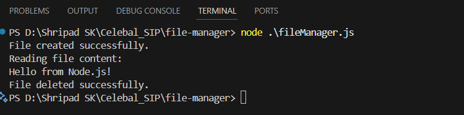

# File Manager

A simple Node.js script to create, read, and delete a file.

## Files

- [`fileManager.js`](fileManager.js): Main script to demonstrate file operations.
- [`package.json`](package.json): Project metadata and configuration.
- 

## Usage
1. **Install Node.js** if you haven't already: [https://nodejs.org/](https://nodejs.org/)
2. Open a terminal in this project directory.
3. Run the script:

   ```sh
   node fileManager.js
   ```

## What It Does

- Creates a file named `example.txt` with the content "Hello from Node.js!".
- Reads and prints the content of `example.txt`.
- Deletes `example.txt` after reading.
